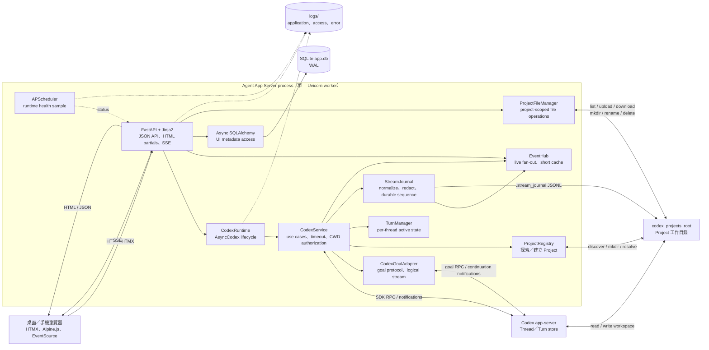
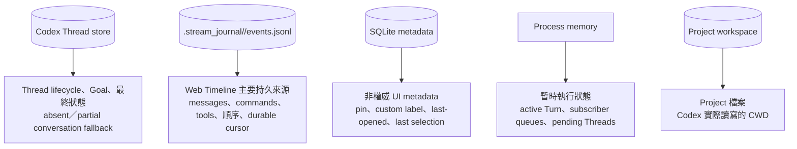
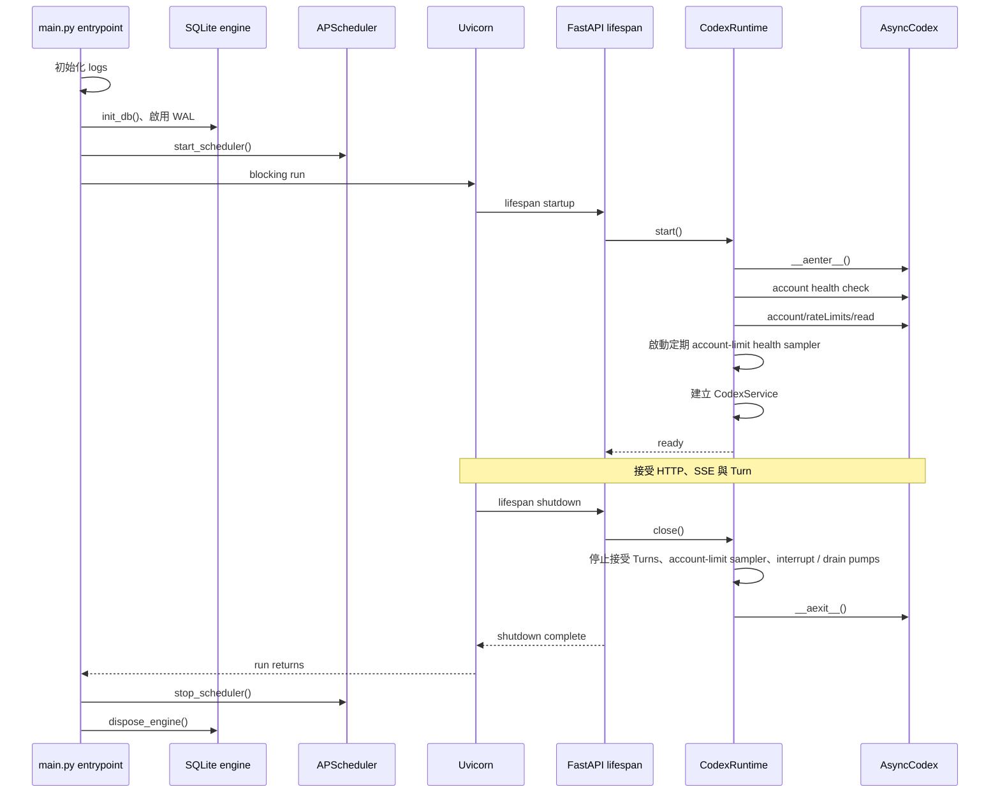

# Agent App Server 系統架構

本文件描述目前程式碼的系統邊界、元件責任、狀態權責與啟停 lifecycle。操作層級的 request、Turn 與 SSE 流程請見[操作流程](flows.md)。

## 系統邊界

### 邊界與信任模型

- Browser 只提交 server 產生的 `project_key`，不能提交任意 CWD。建立 Project 時只能提交一個目錄名稱。
- `ProjectRegistry` 只接受 `codex_projects_root` 的第一層實體目錄，忽略 symlink；名稱不符合安全 key 格式時會產生穩定、opaque 的 key。
- `ProjectFileManager` 只接受相對於 Project root 的 path，逐層拒絕 symlink、absolute path、path traversal、control characters 與 special file。Files UI 的修改與刪除會直接作用於 workspace。
- `CodexService` 在 Thread list、resume 與 read 後持續核對實際 CWD。Thread 不屬於 registry 內 Project 時一律視為 `404`。
- `require_web_user` 目前只是 authentication 的整合接點。development 綁定 loopback；版本庫內的 production 設定則綁定 `0.0.0.0:8080`。正式 authentication、TLS 與受信任的存取層完成前，production 必須覆寫回 loopback 或限制在可靠的內部存取層後方。

## 元件責任

| 元件 | 主要責任 | 狀態範圍 |
| --- | --- | --- |
| `main.py` | 組裝 FastAPI、middleware、routes、partials、SSE 與 process entrypoint | Process / request |
| `CodexRuntime` | 建立唯一 `AsyncCodex`、保存 Agents.md／account 啟動快照、定期更新 account limits、組裝 service、關閉 client | ASGI lifespan |
| `CodexService` | Account、model、Thread、Turn、Goal use cases；RPC timeout 與錯誤轉換；CWD authorization | ASGI lifespan |
| `CodexGoalAdapter` | 將 SDK goal get/set/clear 與多個 physical continuation Turns 包裝成單一 logical operation | ASGI lifespan / Goal operation |
| `ProjectRegistry` | 探索 root 第一層目錄、建立 Project、key/path 對應 | Process；讀取時 refresh |
| `ProjectFileManager` | 在單一 Project 內列出、上傳、下載、建立、重新命名與刪除檔案；拒絕 path escape 與 symlink | Request / workspace |
| `TurnManager` | 原子保留 Turn、維持 active handle/task、排除衝突 mutation、shutdown drain | Process memory |
| `StreamJournal` | SDK event normalize／redact、per-thread JSONL append、durable sequence、history backfill、Timeline materialization、retention／trash | Project persistent data |
| `EventHub` | 已持久事件的即時 fan-out、短期 cache、bounded subscriber queue | Process memory |
| SQLAlchemy / SQLite | Pin、label、last-opened 與最後選擇等 Web UI metadata | Persistent |
| APScheduler | 低頻 scheduler liveness sample | Process |
| Jinja2 / HTMX / Alpine.js | Server-rendered partials、browser interaction、目前 Thread 的 `EventSource` 與 per-Thread replay cursor | Browser memory / request |

## 資料權責

SQLite 不鏡像 prompt、agent response、command output、diff、Goal、token 或 Codex conversation。已送往 SSE 的 sequence 來自 Stream Journal，backend restart 後仍可 replay；active Turn／Goal handle、subscriber queue 與新建後尚未出現在 SDK list 的 pending Thread 則仍是 process-local。Journal absent／partial 時才以 Codex history 補 conversation，Journal 獨有的 command／tool activity 不會被覆蓋。

## Process 與 ASGI lifecycle

Database 與 scheduler 是 process-level resource；`AsyncCodex` 則由 FastAPI lifespan 擁有。這也是不能直接以 `uvicorn main:app` 取代正式 entrypoint 的原因。

Scheduler 與 database 的 cleanup 分別執行；前一項失敗不會略過後一項。

## 為何限制單一 worker

以下協調狀態都保存在單一 Python process：

- 每個 Thread 是否已有 active Turn 或 logical Goal operation。
- Turn／Goal handle、event-pump task 與 shutdown drain。
- SSE subscriber queues 與短期 EventHub cache（durable sequence／replay 已在 Journal）。
- 尚未出現在 Codex `thread_list` 的 pending Thread。

多 worker 會各自持有不同 active state 與 subscriber，因此仍無法保證「同一 Thread 只有一個 active Turn」或正確 steer／interrupt。Stream Journal 已讓歷史 replay 不依賴單一 process，但要水平擴展仍須外部化 lock、active handle routing 與 subscriber fan-out。
