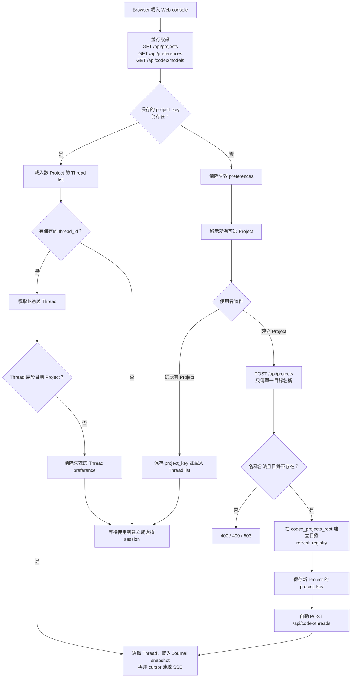
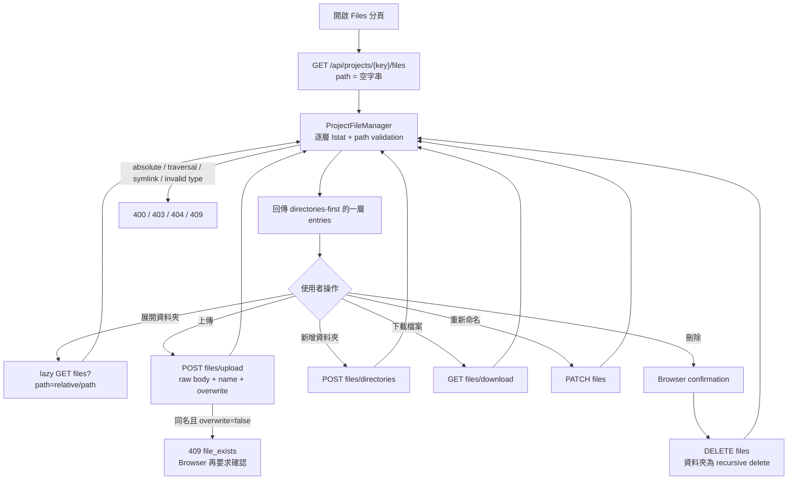
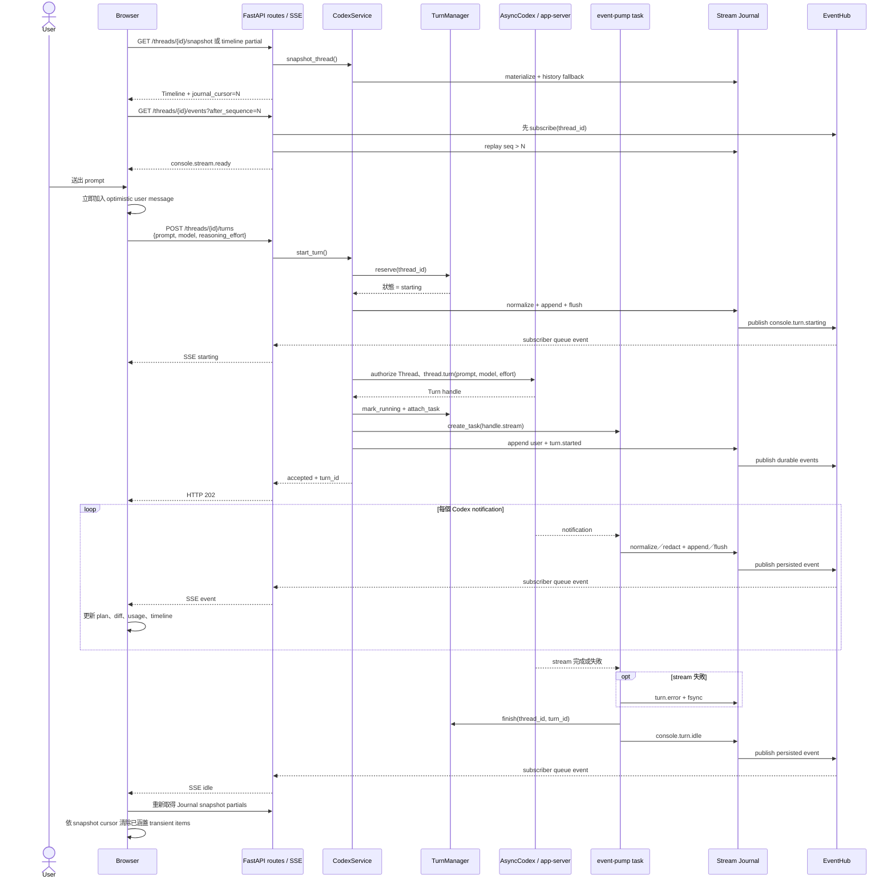
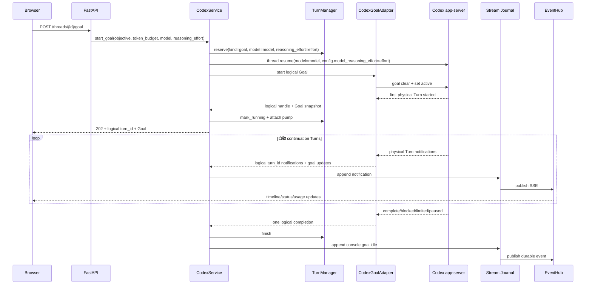
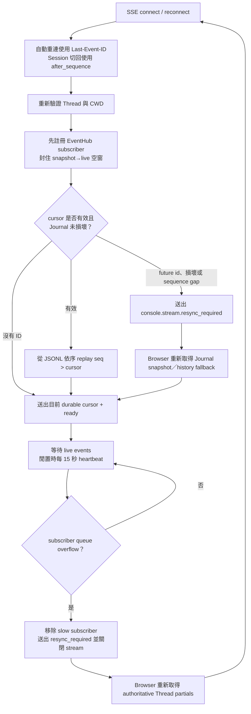

# Agent App Server 操作流程

本文件描述目前 Web console 的 Project／Files／Thread 操作、Turn 執行與 SSE reconnect 行為。元件與狀態邊界請見[系統架構](architecture.md)。

## 初次載入與建立 Project

Browser 初始化時會並行讀取 Project、UI preferences 與 models。只有保存的 Project 仍存在時才恢復選擇；無效 preference 會被清除，不會自動選取第一個 Project。

建立 Thread 後，如果 Codex `thread_list` 尚未立即列出它，`CodexService` 會暫存在 pending map，讓 timeline、inspector、composer 與 SSE authorization 仍可立即使用。Thread 出現在正式 list 後，pending entry 會被移除。

## 瀏覽與修改 Project files

Files 分頁只使用目前選定的 `project_key`。Browser 不提交 server absolute path；每個 request 都由 registry 重新取得 Project，再由 `ProjectFileManager` 解析 project-relative path。

Directory listing 不顯示 symbolic link 或 special file；後續直接指定這些 path 也會被拒絕。上傳先寫入目標資料夾內的 temporary file，flush／fsync 後再放置到最終名稱。未確認 overwrite 時，同名檔案不會被改動。

## 啟動與串流一個 Turn

Browser 先建立目前 Thread 的 SSE，收到 `console.stream.ready` 後才允許送出新 Turn。模型選單會使用 `model/list` 回傳的 `default_reasoning_effort` 與 `supported_reasoning_efforts`，只列出目前模型支援的 reasoning 等級；未明確選擇時沿用模型預設值，`max`／`ultra` 會提示較快消耗 usage limits。後端在單一 async lock 內先保留 `starting` 狀態，避免兩個同時送達的 request 都通過檢查。

使用者訊息、agent delta 與完成的 tool results 共用依到達順序排列的 live timeline。Browser 在 HTTP request 前先顯示使用者訊息；POST／steer 成功後以回傳的 `journal_cursor` 綁定 optimistic item。收到 `item/completed` 時，agent、command、file change、MCP／dynamic tool 等最終 item 立即關閉 streaming UI。snapshot 回傳 cursor `N` 後，前端可移除所有 `sequence <= N` 的 transient item，不再依賴 live `msg_...` 與 history `item-N` 相等。

同一 Thread 已是 `starting`、`running`、`stopping`、正在執行互斥 mutation，或 Codex store 仍有不受目前 process 管理的 active persisted Goal 時，新 Turn 會回 `409`。不同 Threads 使用不同 active entry，因此可並行。活動 Turn 上再次送出 prompt 會走 steer；steer 也會先加入 optimistic user message，並讓後續 agent delta 建立在它之後。Interrupt 會先呼叫 handle，再發布 `console.turn.stopping`。

## Long-running Goal

Browser 可由 Inspector 表單或 composer `/goal` 指令操作 Goal。所有 Goal endpoint 都先做相同的 Thread/CWD allow-list 驗證；Goal snapshot 直接讀取 Codex Thread store，不寫入 SQLite。

若使用者在尚未建立 Session 的 draft composer 直接輸入 `/goal <objective>`，Browser 會以 `POST /threads` 的 `initial_goal` 建立 Session 並立即註冊 logical Goal operation。這可確保第一個 physical Turn 開始前就已建立 goal route，後續 continuation Turns 全部映射到同一 logical turn ID。

Goal active 期間與一般 Turn、fork、archive 等 mutation 互斥。一般 composer 文字仍可 steer 目前的 physical Goal Turn；`Pause`／`Stop` 會先把 Goal 設為 paused 再 interrupt physical Turn，避免 continuation 自動重啟。Graceful shutdown 同樣透過 logical handle pause 並 drain Goal pump。Browser 中斷 SSE 不會停止 Goal；斷線期間的 notification 仍寫入 Journal，重連時從 durable cursor replay。

Codex Goal RPC 本身不帶 model 或 reasoning effort 欄位，因此 Web 在啟動或恢復 Goal 前，會在同一個 per-thread reservation 內先用 `thread/resume` 套用目前選定的 model 與 `config.model_reasoning_effort`。後續由 runtime 自動建立的 continuation Turns 便沿用該 Thread 設定；`console.goal.starting` 與 `console.goal.running` 也會攜帶相同 model／reasoning effort，讓其他分頁及重新渲染後的 Inspector 顯示一致。

### Logical Goal 與 physical Turn ID

Browser 並不直接接管 Codex Turn handle，也不針對某個 Turn ID 建立 SSE。它訂閱的是 `/threads/{thread_id}/events`，所以同一 Thread 內開始新 Turn 或 Goal continuation 時，不需要重建 EventSource。Turn ID 的控制權留在 backend：

- 一般 Turn 的 `TurnManager` entry 持有該次 physical Turn ID 與 handle。
- Goal 的 `TurnManager` entry 持有一個 logical turn ID 與 `CodexGoalHandle`。
- `CodexGoalAdapter` 在 Goal 啟動前先註冊 thread-scoped route，將每個 continuation 的 physical Turn notification 改寫為同一 logical turn ID。
- `thread/status/changed` 是 Thread 層 global notification，本身不提供可靠的 Turn ID；它只更新顯示狀態，不能用來替換 backend 正在控制的 handle。
- Browser 收到 `console.goal.running` 後維持 `activeKind=goal`。Goal 在兩個 physical Turns 之間短暫回報 Thread idle 時，只要 persisted Goal 仍為 `active`，前端仍顯示 running。

因此，「前端接上新的 active turn」的實際語意是：EventSource 持續接收同一 Thread 的新事件，而 backend adapter 負責 physical Turn rollover。Browser 不需要、也不應猜測新的 physical Turn ID。

### Draft `/goal` 錯路由與防線

新 Session 的 draft composer 必須在普通 `initial_prompt` 之前辨識 `/goal <objective>`。若先把 `/goal` 當成普通首個 Turn，可能形成以下失配：

1. Console 以 `kind=turn` 啟動普通 Turn。
2. 該 Turn 內的 agent 建立 persisted Goal。
3. 普通 Turn 完成，Console 釋放它的 handle；Codex Goal 則繼續自動建立 physical continuation Turn。
4. Console 在不知道 Goal physical Turn 的情況下又啟動普通 Turn，local handle ID 與 Codex authoritative active Turn ID 不一致。
5. 後續 steer／interrupt 可能收到 `expected active turn id ... but found ...`，UI 若只切到 stopping 而未收尾便會停留在錯誤狀態。

目前由以下機制共同避免這個狀況：

- Draft `/goal <objective>` 使用 `POST /threads` 的 `initial_goal`，建立 Session 後直接呼叫 `start_goal()`，第一個 physical Turn 開始前即完成 logical route 註冊。
- `start_turn()` 在呼叫 `thread.turn()` 前讀取 persisted Goal；若其狀態仍為 `active`，回 `409 active_turn_conflict`，不建立競爭的普通 handle。
- 普通 Turn 若已收到 authoritative Thread idle，卻在 grace period 內未收到 terminal notification，會由 `codex_turn_idle_reconcile_seconds` 控制的 reconciliation 發出 `turn.error` 與 `console.turn.idle`。目前 `settings.toml` 設為 10 秒。
- Interrupt 若回報 expected-ID mismatch 或已無 active Turn，會視為 stale handle 的冪等收斂，清除 local active entry，而不是留下永久 stopping。
- Idle reconciliation 只處理 `kind=turn`；logical Goal 在 continuation rollover 間可能正常短暫 idle，因此不套用這條回收規則。

若 process 非預期中止，而 Codex store 仍留有 active Goal，Browser 可以靠 Journal replay 與 Thread SSE 恢復畫面，但無法只靠 SSE 重建已遺失的 process-local controllable handle。此時新普通 Turn 會先被上述 persisted Goal guard 阻擋；操作上應先 Pause persisted Goal，再由 Web Resume，使 backend 在重新啟用 Goal 前註冊新的 logical operation。

## SSE reconnect、replay 與 resync

每個 Thread 的 sequence 由 Project 內的 Stream Journal 永久配置；SSE event `id` 與 JSONL `seq` 相同。Browser 選取 Session 時先載入 snapshot，從 HTML 的 `data-journal-cursor` 建立 high-water mark，再以 `after_sequence` 連線。重新整理不需要保存 Browser cursor，因為新 snapshot 會重新提供 durable cursor。原生 `EventSource` 自動重連時仍使用 `Last-Event-ID`，且 header 優先於 URL query。完整邊界案例請見 [Session event replay](session-event-replay.md)。

SSE 建立時會先註冊 live subscriber，再讀取 JSONL。若其間有新事件，它同時出現在 replay 與 subscriber queue，後端以 snapshot high-water sequence 過濾 queue 中的重複，因此 snapshot 與 live 之間沒有空窗。EventHub history 只作短期相容 cache；durable replay 不受其 bounded window 或 backend restart 影響。

Journal reader 遇到不完整最後一行時會忽略該行並把 coverage 降為 `partial`；中間損壞、重複／倒退 sequence 或 future cursor 會觸發 resync。Browser 清除 transient state、重載 snapshot，再用新的 durable cursor 連線。Slow subscriber overflow 也會送出 resync 並關閉連線，但已落盤事件仍可完整補回。

EventHub fan-out 不會因某個 Browser queue 滿而反向阻塞 Codex pump。Publish 使用非阻塞 enqueue；queue overflow 時會移除 slow subscriber、送出 `console.stream.resync_required` 並關閉該 stream，Browser 再從 durable Journal 補回。因此 Turn 長時間停在 running／stopping 時，應先比對 `TurnManager` handle、persisted Goal 與 authoritative Thread status；`dropped_subscriber_count=0` 時更不應把原因歸因為 SSE sequence buffer。`subscriber_count=0` 則只表示當下沒有開啟中的 Thread EventSource，不代表 queue 已滿。

## 關閉中的 Turn

收到 shutdown 後，`CodexRuntime` 先將 `ready` 設為 false，`TurnManager` 停止接受新 Turn，接著對所有可控制的 handles 發出 interrupt。Event-pump tasks 會在 timeout 內 drain；逾時的 task 會被 cancel。完成後才關閉 `AsyncCodex`，最後由 process entrypoint 停止 scheduler 並 dispose database engine。
