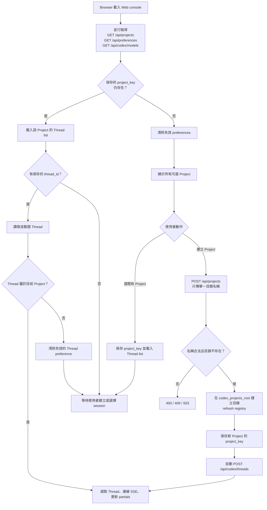
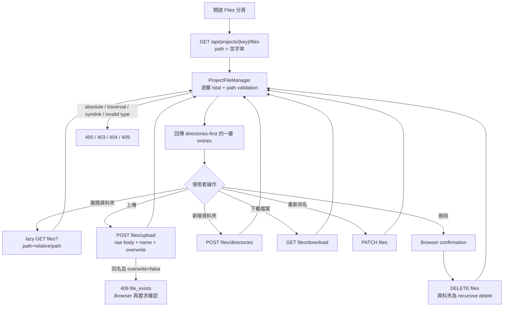
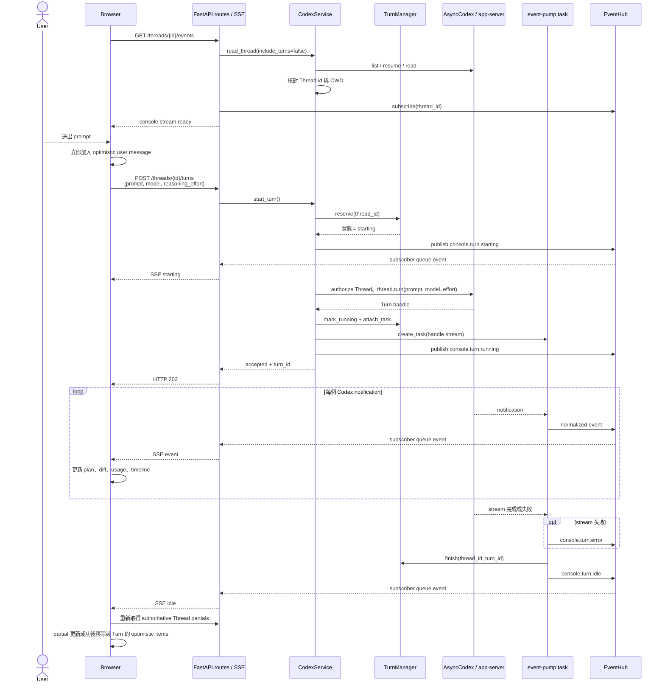
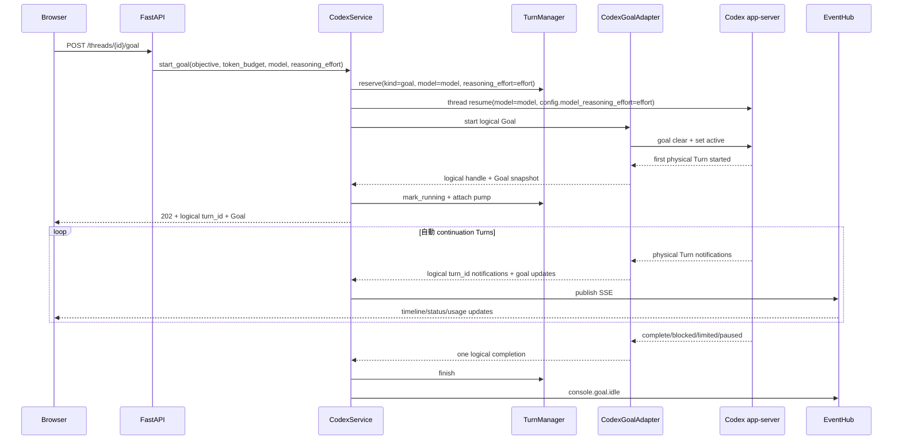
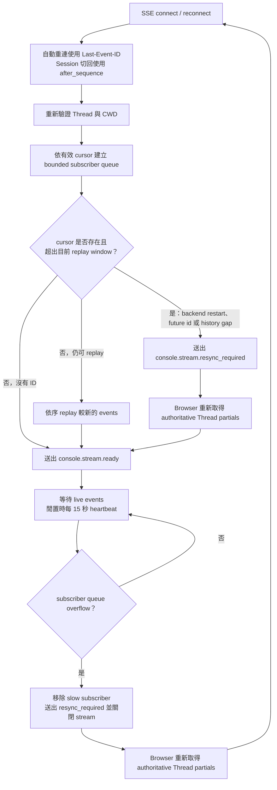

# Agent App Server 操作流程

本文件描述目前 Web console 的 Project／Files／Thread 操作、Turn 執行與 SSE reconnect 行為。元件與狀態邊界請見[系統架構](architecture.md)。

## 初次載入與建立 Project

Browser 初始化時會並行讀取 Project、UI preferences 與 models。只有保存的 Project 仍存在時才恢復選擇；無效 preference 會被清除，不會自動選取第一個 Project。

建立 Thread 後，如果 Codex `thread_list` 尚未立即列出它，`CodexService` 會暫存在 pending map，讓 timeline、inspector、composer 與 SSE authorization 仍可立即使用。Thread 出現在正式 list 後，pending entry 會被移除。

## 瀏覽與修改 Project files

Files 分頁只使用目前選定的 `project_key`。Browser 不提交 server absolute path；每個 request 都由 registry 重新取得 Project，再由 `ProjectFileManager` 解析 project-relative path。

Directory listing 不顯示 symbolic link 或 special file；後續直接指定這些 path 也會被拒絕。上傳先寫入目標資料夾內的 temporary file，flush／fsync 後再放置到最終名稱。未確認 overwrite 時，同名檔案不會被改動。

## 啟動與串流一個 Turn

Browser 先建立目前 Thread 的 SSE，收到 `console.stream.ready` 後才允許送出新 Turn。模型選單會使用 `model/list` 回傳的 `default_reasoning_effort` 與 `supported_reasoning_efforts`，只列出目前模型支援的 reasoning 等級；未明確選擇時沿用模型預設值，`max`／`ultra` 會提示較快消耗 usage limits。後端在單一 async lock 內先保留 `starting` 狀態，避免兩個同時送達的 request 都通過檢查。

使用者訊息、agent delta 與完成的 tool results 共用依到達順序排列的 live timeline。Browser 在 HTTP request 前先顯示使用者訊息；POST／steer 失敗時移除該 optimistic item 並還原 composer。收到 `item/completed` 時，command、file change、MCP／dynamic tool 等最終 item 會立即顯示為 tool-card，不需等待整個 Turn idle。新的 agent segment 或 tool-card 開始時，前一段會結束 `streaming`／`aria-busy` 狀態，只有目前輸出的最後一段保留閃爍游標。成功時用回傳或 SSE 的 `turn_id` 綁定 item，等 idle 後 authoritative partial 更新成功才清除，避免重複或 refresh 失敗時遺失訊息。

同一 Thread 已是 `starting`、`running`、`stopping` 或正在執行互斥 mutation 時，新 Turn 會回 `409`。不同 Threads 使用不同 active entry，因此可並行。活動 Turn 上再次送出 prompt 會走 steer；steer 也會先加入 optimistic user message，並讓後續 agent delta 建立在它之後。Interrupt 會先呼叫 handle，再發布 `console.turn.stopping`。

## Long-running Goal

Browser 可由 Inspector 表單或 composer `/goal` 指令操作 Goal。所有 Goal endpoint 都先做相同的 Thread/CWD allow-list 驗證；Goal snapshot 直接讀取 Codex Thread store，不寫入 SQLite。

Goal active 期間與一般 Turn、fork、archive 等 mutation 互斥。一般 composer 文字仍可 steer 目前的 physical Goal Turn；`Pause`／`Stop` 會先把 Goal 設為 paused 再 interrupt physical Turn，避免 continuation 自動重啟。Graceful shutdown 同樣透過 logical handle pause 並 drain Goal pump。Browser 中斷 SSE 不會停止 Goal，重連後沿用 EventHub replay；超出 replay window 時重新讀取 Thread history 與 Goal snapshot。

Codex Goal RPC 本身不帶 model 或 reasoning effort 欄位，因此 Web 在啟動或恢復 Goal 前，會在同一個 per-thread reservation 內先用 `thread/resume` 套用目前選定的 model 與 `config.model_reasoning_effort`。後續由 runtime 自動建立的 continuation Turns 便沿用該 Thread 設定；`console.goal.starting` 與 `console.goal.running` 也會攜帶相同 model／reasoning effort，讓其他分頁及重新渲染後的 Inspector 顯示一致。

## SSE reconnect、replay 與 resync

每個 Thread 都有 process-local 單調 sequence 與有限 history。SSE event 的 `id` 就是 sequence；Browser 每成功處理一筆 event，也會在頁面記憶體內保存該 Thread 的最後 sequence。原生 `EventSource` 因網路問題自動 reconnect 時會用 `Last-Event-ID` 要求缺少的事件；使用者主動切換 Session 時會關閉舊 SSE，切回後建立帶有 `after_sequence` query cursor 的新 SSE。這份 per-Thread cursor 不寫入 SQLite 或 Browser persistent storage，重新整理頁面後仍以 Codex Thread history 重新建立基準。完整設計、邊界案例與測試對照請見 [Session event replay](session-event-replay.md)。

Replay 只用來補足短暫斷線，不是持久化 event store。遇到 process restart、history gap 或 slow subscriber overflow 時，UI 必須回到 Codex Thread history 重新同步，不能把本地 live event list 當成權威資料。

`Last-Event-ID` header 與 `after_sequence` 同時存在時，Backend 以 header 為準，因為它代表同一個 `EventSource` 已經在目前 URL cursor 之後成功收到的新事件。若 cursor 早於 EventHub 最舊保留事件，或 Backend restart 後 cursor 大於重新開始的 sequence，Backend 會送出 `console.stream.resync_required`。Browser 此時以事件攜帶的目前 sequence 重設該 Thread cursor、清除 transient live state，並重新讀取 Codex Thread／Goal 的 authoritative partials；同一條 SSE 隨後繼續承接較新的 live events。

## 關閉中的 Turn

收到 shutdown 後，`CodexRuntime` 先將 `ready` 設為 false，`TurnManager` 停止接受新 Turn，接著對所有可控制的 handles 發出 interrupt。Event-pump tasks 會在 timeout 內 drain；逾時的 task 會被 cancel。完成後才關閉 `AsyncCodex`，最後由 process entrypoint 停止 scheduler 並 dispose database engine。
