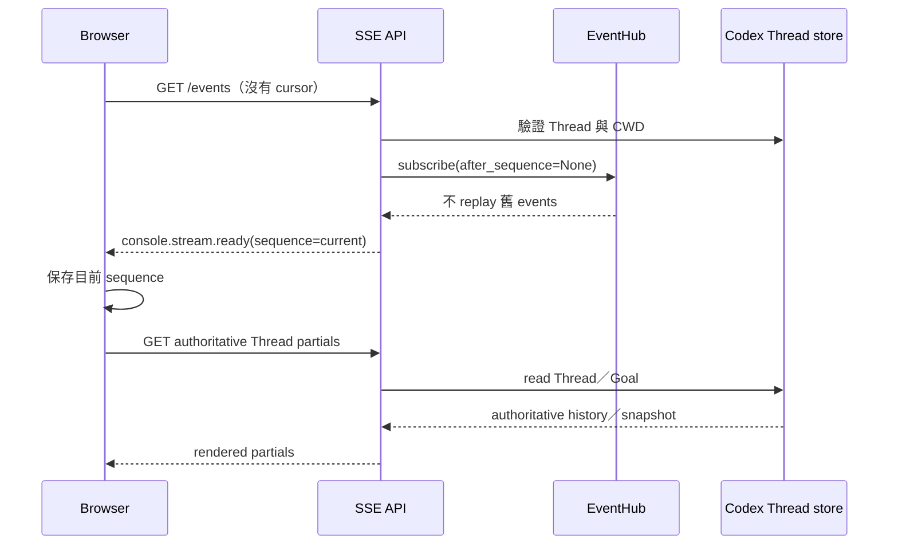
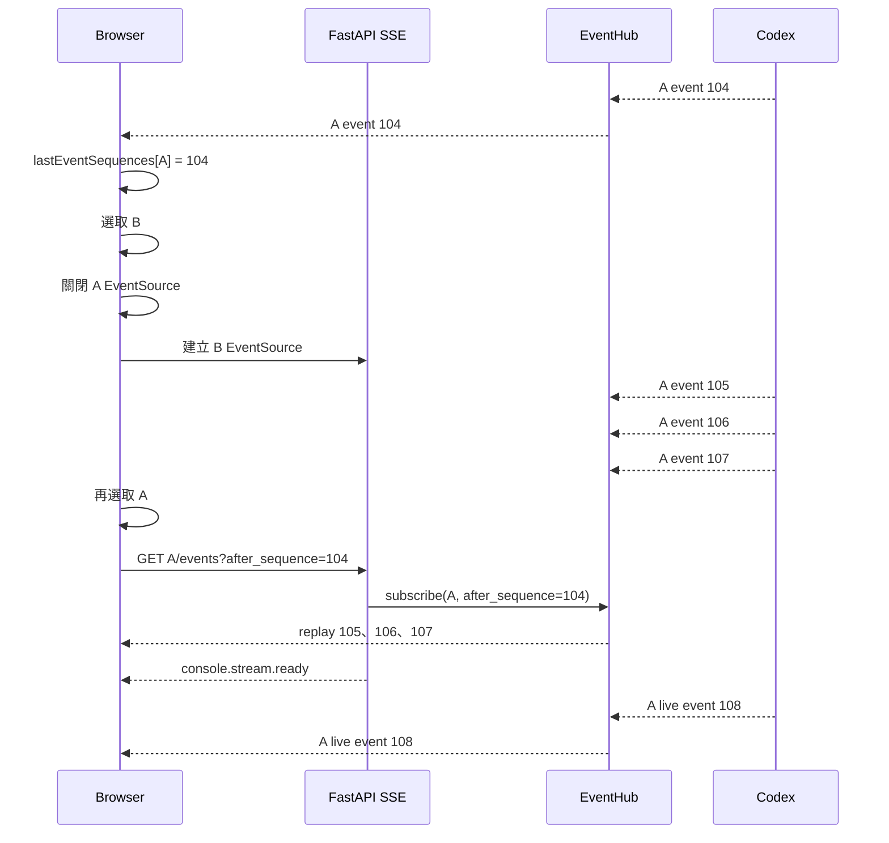

# Session 切換的 SSE replay 與 resync

本文件說明 Web console 在切換 Session 時，如何關閉舊 SSE、記住每個 Codex Thread 的最後 event sequence、切回後從 EventHub 補收事件，以及 replay window 不完整時如何回到 Codex Thread history 重新同步。

相關的一般架構與 API 說明請見[系統架構](architecture.md)、[操作流程](flows.md)與 [API 參考](api.md)。

## 目標與設計選擇

原本前端只持有一個 `EventSource`。選取另一個 Session 時會關閉舊連線並清除 `livePlans`、live timeline、diff、usage 等 transient state；切回時建立的是全新 `EventSource`，原生瀏覽器不會把舊物件的 `Last-Event-ID` 自動帶給新物件。因此，切換期間雖然 Backend 的 EventHub 仍收到 Codex events，Browser 卻沒有 cursor 可以要求 replay。

本實作保留「同一時間只連線目前 Session」的模型，不為每個曾開啟的 Session 維持背景 SSE。Browser 只需為每個 Thread 保存一個 sequence 整數：

```text
thr_A -> 104
thr_B -> 56
thr_C -> 892
```

這個選擇具有以下特性：

- Browser 與 Backend 都只需維持目前 Session 的一條 SSE connection。
- 切換期間的事件由既有 EventHub bounded history 暫存，不需要新增 event database。
- Browser 不保存完整對話或 event payload，只保存 per-Thread cursor。
- EventHub 無法提供連續 replay 時，仍以 Codex Thread store 為唯一權威來源。

## 狀態與資料權責

| 狀態 | 保存位置 | 生命週期 | 是否為權威來源 |
| --- | --- | --- | --- |
| Threads、Turns、Goals、Items、messages、plan items、diff、usage | Codex Thread store | Codex 管理 | 是 |
| Event sequence、最近 events、subscriber queues | Backend `EventHub` | Web process memory | 否 |
| 每個 Thread 最後處理的 sequence | Browser `lastEventSequences` | 目前頁面 memory | 否 |
| Pin、label、last-opened、最後選擇 | SQLite | Persistent | 僅 UI metadata |

Browser cursor 不寫入 SQLite、`localStorage` 或 `sessionStorage`。重新整理或關閉頁面後，cursor 會消失；重新載入時由 Codex Thread history 建立畫面，再從新的 SSE subscription 接收後續事件。

## EventHub 的 sequence 與 bounded history

Backend 對每個 Thread 維持獨立的 `_ThreadEvents`：

- `sequence`：從 0 開始、每次 publish 加 1。
- `history`：`deque(maxlen=history_limit)`，預設保存最後 2,000 筆。
- `subscribers`：目前訂閱該 Thread 的 bounded queues。

每個 SSE event 的 `id` 與 JSON payload 中的 `sequence` 相同：

```text
id: 105
data: {"sequence":105,"thread_id":"thr_A",...}
```

設定來源：

```toml
codex_event_history_limit = 2000
codex_subscriber_queue_limit = 1000
codex_sse_heartbeat_seconds = 15
```

`codex_event_history_limit` 是每個 Thread 的 replay window，不是所有 Threads 共用的總筆數。這些資料只存在目前 Web process；Backend restart 後 sequence 與 history 都會重新開始。

## Browser cursor lifecycle

Alpine.js root state 使用沒有 prototype 的物件保存 cursor：

```javascript
lastEventSequences: Object.create(null)
```

收到並成功交給 `handleEvent()` 後，Browser 才呼叫 `rememberEventSequence()`。一般事件只允許 cursor 單調增加，並且只接受非負的 safe integer。

```text
目前 cursor = 104
收到 sequence 105 -> 保存 105
收到 sequence 103 -> 保持 105
收到無效值       -> 忽略
```

唯一允許 cursor 下降的情況是 `console.stream.resync_required`。這點對 Backend restart 很重要：例如 Browser 記得 1042，但新 EventHub 的目前 sequence 是 0；Browser 必須用 resync event 的 sequence 0 取代 1042，否則之後每次切回都會繼續提交無效的 future cursor。

永久刪除 Session 成功後，Browser 同時刪除該 Thread 的 cursor。Archive 或切換 Project 不會刪除 cursor，因此同一頁面內重新開啟該 Thread 時仍可嘗試 replay。

## 初次選取 Session

第一次選取某個 Session 時還沒有 cursor：



沒有 cursor 時，EventHub 不會把 process 啟動以來的全部 history 當作初始畫面。Timeline、Plan trajectory、changes、Goal 與 composer 狀態由 Codex authoritative partials 建立；`console.stream.ready` 的 sequence 則成為後續 Session 切換的增量基準。

## Session A → B → A 的 replay 流程

假設 Browser 正在觀看 Session A，最後成功處理到 sequence 104：



前端 `connectEvents(threadId)` 會：

1. 關閉目前 `EventSource`。
2. 查詢該 Thread 的 `lastEventSequence()`。
3. 有 cursor 時建立 `/events?after_sequence=<cursor>`；沒有時使用原 URL。
4. 驗證收到的 `event.thread_id` 與目前 subscription 相符。
5. 先處理 event，再更新該 Thread cursor。

Session 切換仍會重新取得 authoritative partials。replay events 用來補回尚未或不一定已物化到 Codex Thread history 的即時輸出，例如 agent deltas、plan updates、tool completion 與狀態變化。

## SSE API cursor 規則

Endpoint：

```http
GET /api/codex/threads/{thread_id}/events?after_sequence=104
```

`after_sequence` 必須是非負整數。Backend 在建立 subscription 前仍會透過 `read_thread(include_turns=false)` 驗證 Thread 存在且 CWD 屬於允許的 Project。

Backend 支援兩種 cursor：

| 輸入 | 來源 | 用途 |
| --- | --- | --- |
| `Last-Event-ID` request header | 同一個原生 `EventSource` 自動 reconnect | 網路中斷後續接 |
| `after_sequence` query | Browser 建立新的 `EventSource` | 主動切換 Session 後續接 |

兩者同時存在時以 `Last-Event-ID` header 為準。原因是新 `EventSource` 的 URL 可能仍帶著建立當下的 query cursor 104，但同一物件在收到 105～110 後若發生網路重連，瀏覽器送出的 header 110 才是最新進度。若錯誤地優先使用 query，Backend 會重播已處理的事件。

無效的 `Last-Event-ID` 會回傳 bad request；負數 `after_sequence` 由 FastAPI query validation 拒絕。

## Backend replay 判定

在同一個 EventHub lock 內取得 history snapshot 並註冊 subscriber，以避免 replay snapshot 與 live subscription 之間出現未受保護的間隙。判定可簡化為：

```text
if cursor 不存在:
    不 replay，直接進入 live subscription
elif cursor > current_sequence:
    resync_required
elif history 非空 且 cursor < oldest_sequence - 1:
    resync_required
else:
    replay 所有 sequence > cursor 的 events
```

假設 history limit 為 2，EventHub 目前只保留 sequence 2、3：

| Browser cursor | 結果 | 原因 |
| --- | --- | --- |
| 3 | 不 replay | 已在最新位置 |
| 2 | replay 3 | 後續區間完整 |
| 1 | replay 2、3 | cursor 正好在 window 前一筆，區間仍完整 |
| 0 | resync | sequence 1 已不在 EventHub，存在 history gap |
| 4 | resync | cursor 位於 Backend current sequence 的未來 |

## 超出 2,000-event window 的完整 resync

假設 EventHub 已經產生到 sequence 3000，且只保留 1001～3000：

- Browser cursor 2500：可以完整 replay 2501～3000。
- Browser cursor 500：缺少 501～1000，不能安全 replay。

第二種情況 Backend 送出 synthetic event：

```text
console.stream.resync_required(sequence=3000)
```

Browser 收到後會：

1. 清除 `liveEvents` 與 pending live events。
2. 清除 live timeline 與尚未 flush 的 agent deltas。
3. 清除 `livePlans`、`liveDiff`、`liveUsage` 與 `liveGoal`。
4. 呼叫 `refreshThread()` 重新讀取 timeline、inspector、latest changes 與 composer partials。
5. Inspector 另外從 Codex 讀取 Goal snapshot，並從 Thread items 重建最近三筆 plan history。
6. 用 resync event 的目前 sequence **取代** Browser 原 cursor。
7. 繼續處理同一 subscription 後續的 live events。

這個 fallback 不會從 SQLite 重建對話。SQLite 沒有 prompt、agent response、command output、diff、Goal、usage 或 Codex conversation mirror。

## Subscriber queue overflow

每個 subscription queue 預設最多 1,000 筆。如果 Browser 太慢而 queue 已滿，EventHub 會：

1. 從該 Thread 移除 slow subscriber。
2. 清空該 subscriber queue。
3. 放入內部 `_RESYNC` sentinel。
4. 增加 dropped subscriber counter。

SSE generator 讀到 sentinel 後送出 `console.stream.resync_required`，接著結束該 stream。Browser 先重新讀取 Codex authoritative partials；原生 `EventSource` 隨後自動 reconnect，並以剛收到的 resync event ID 作為 `Last-Event-ID`。即使 URL 還保留較舊的 `after_sequence`，Backend 也會因 header 優先而使用最新 cursor。

## Backend restart

EventHub 是 process-local。Backend restart 後：

- 所有 per-Thread history 消失。
- 每個 Thread 的 EventHub sequence 從 0 重新開始。
- Browser 頁面如果仍存活，可能提交 restart 前的較大 cursor。

因為舊 cursor 大於新 `current_sequence`，Backend 會要求 resync。Browser 必須允許 resync 將 cursor 從舊值降到新值，例如 1042 → 0，然後從 Codex Thread history 重建畫面。

## Plan trajectory 的行為

Plan trajectory 同時合併兩種來源：

- Codex Thread history 中 `type == "plan"` 的 items，取最近三筆。
- SSE `turn/plan/updated` 的 live revisions，與 history 去除相同文字後保留最近三筆。

因此：

- 切換時間短、events 仍在 EventHub window：切回後可 replay live plan revisions。
- replay window 已缺資料：以 Codex history 中仍存在的 plan items 重建。
- 某個 revision 只存在於 SSE、從未物化到 Codex history，而且也已離開 EventHub window：該 revision 無法復原。這是 bounded replay 與「Codex 是唯一權威來源」共同產生的刻意限制。

## 失敗與恢復矩陣

| 情境 | Cursor 來源 | 恢復方式 |
| --- | --- | --- |
| Session A → B → A，events 仍在 window | Browser per-Thread memory | `after_sequence` 增量 replay |
| 同一 `EventSource` 暫時斷線 | Browser 原生 EventSource | `Last-Event-ID` 增量 replay |
| Cursor 早於最舊 history | Browser memory/header | `resync_required` → Codex history |
| Cursor 大於 Backend current sequence | Restart 前 Browser memory/header | `resync_required` → Codex history，重設 cursor |
| Slow subscriber queue overflow | SSE event ID | `resync_required` → Codex history → 自動 reconnect |
| Browser reload／關閉後重開 | 無 cursor | Codex history 建立初始畫面，再保存 ready sequence |
| Session 永久刪除 | 不再使用 | 刪除 Browser cursor |

## 多分頁與單一 worker

每個 Browser tab 都有自己的 `lastEventSequences` 與目前 `EventSource`。不同分頁可以各自訂閱相同 Thread，EventHub 會 fan out 到各 subscriber queue；一個分頁切換 Session 不會關閉另一個分頁的 connection。

EventHub sequence、history 與 subscriber state 都在單一 Web process memory，因此服務仍必須使用單一 Uvicorn worker。多 worker 無法保證 request 連到持有相同 Thread history 的 process；若要水平擴展，必須先將 event log、cursor coordination 與 subscriber fan-out 外部化。

## 安全與隱私邊界

- Query string 只包含非負 sequence，不包含 prompt、response 或 API key。
- SSE endpoint 在 subscribe 前仍執行 Thread／CWD authorization。
- Browser cursor 不是授權憑證，也不能用來存取其他 Thread。
- Replay event payload 只存在 Backend bounded memory 與目前 Browser runtime，不寫入 SQLite。
- Codex authentication 仍使用服務執行帳號的 `~/.codex`，與 replay cursor 無關。

## 主要程式位置

| 檔案 | 實作責任 |
| --- | --- |
| `event_hub.py` | Per-Thread sequence、bounded history、replay gap 判定、subscriber overflow |
| `main.py` | `after_sequence` query、`Last-Event-ID` precedence、SSE replay／ready／resync events |
| `static/js/codex-console.js` | Per-Thread cursor、Session 切回 URL、cursor 更新／重設／刪除、resync UI refresh |
| `templates/_thread_inspector.html` | Plan history 與 live plan trajectory 合併入口 |
| `tests/test_event_hub.py` | Replay boundary、history gap、overflow、restart cursor |
| `tests/test_app.py` | SSE query replay、header precedence、stale cursor resync、cleanup |
| `tests/test_frontend_dependencies.py` | Browser per-Thread cursor frontend contract |

## 驗證

完整測試命令：

```bash
poetry run python -m pytest
```

本實作完成時的結果：

```text
99 passed
```

新增／強化的案例涵蓋：

- `after_sequence` 只 replay cursor 後的 events。
- `Last-Event-ID` 與 query 同時存在時 header 優先。
- Cursor 位於 replay window 邊界時仍可完整 replay。
- Cursor 太舊或位於 future 時送出 `resync_required`。
- Backend restart 後 Browser cursor 可以下降到新 sequence。
- Slow subscriber overflow 會要求 resync 並正確 cleanup。
- Session 切換會保存、帶回及刪除 per-Thread cursor。

## 已知限制

- Replay window 以 event 筆數而非時間計算；高頻 agent deltas 可能比低頻 Session 更快淘汰 history。
- Cursor 只在頁面 memory，Browser reload 不會 replay reload 前的 transient-only events，而是以 Codex history 重建。
- EventHub restart 後不保留舊 sequence namespace，必須依靠 `resync_required` 重設 cursor。
- 無法復原既不在 Codex history、也已離開 EventHub window 的 transient event。
- 本設計不是 durable event sourcing，也不取代 Codex Thread store。
